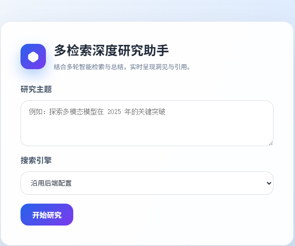
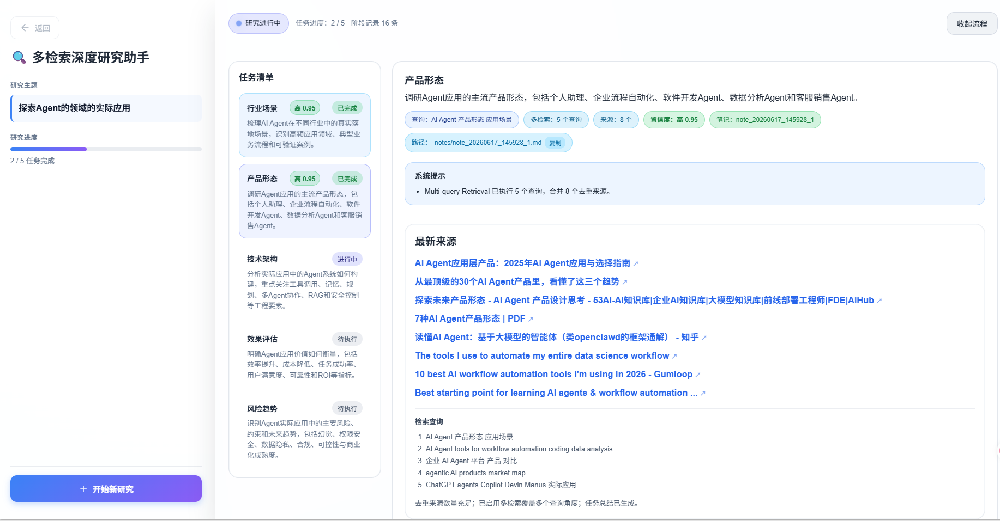

# Multi-query Deep Researcher

> 中文：一个基于 HelloAgents 的多查询深度研究助手。输入研究主题后，系统会自动拆解任务、生成多组检索 query、联网搜索、总结子任务，并最终输出带来源和置信度的 Markdown 研究报告。
>
> English: A HelloAgents-based multi-query deep research assistant. Given a research topic, it plans research tasks, generates multiple search queries, retrieves web evidence, summarizes each task, and produces a Markdown report with sources and confidence signals.

## 项目简介 / Overview

中文：本项目是一个前后端分离的 Deep Research Agent Demo，重点展示“复杂问题拆解 + Multi-query Retrieval + 流式研究过程 + 最终报告生成”的完整链路。它适合用于学习 Agent 工作流，也可以作为个人研究助手的基础版本。

English: This project is a full-stack Deep Research Agent demo. It demonstrates an end-to-end workflow of complex topic decomposition, multi-query retrieval, streaming progress updates, and final report generation. It is useful both for learning Agent workflows and as a foundation for a personal research assistant.

## 核心功能 / Features

- 中文：自动研究规划：根据用户主题生成 3 到 5 个互补的研究任务。
- English: Automatic research planning: decomposes a user topic into 3-5 complementary research tasks.
- 中文：Multi-query Retrieval：每个任务可生成多条检索 query，从不同角度搜索并去重合并来源。
- English: Multi-query retrieval: each task can use multiple query variants, then merge and deduplicate retrieved sources.
- 中文：多搜索后端：支持 `duckduckgo`、`tavily`、`perplexity`、`searxng`、`advanced`。
- English: Multiple search backends: supports `duckduckgo`, `tavily`, `perplexity`, `searxng`, and `advanced`.
- 中文：流式研究过程：前端通过 SSE 实时展示任务状态、来源、总结片段和工具调用记录。
- English: Streaming research progress: the frontend uses SSE to display task status, sources, summary chunks, and tool-call logs in real time.
- 中文：笔记工具集成：通过 HelloAgents `NoteTool` 保存任务过程和最终报告线索。
- English: Note tool integration: uses HelloAgents `NoteTool` to persist task progress and report notes.
- 中文：置信度提示：根据来源数量、查询覆盖、任务状态和降级情况生成启发式置信度评分。
- English: Confidence signals: produces heuristic confidence scores based on source coverage, query diversity, task status, and fallback behavior.
- 中文：智能降级：当上游模型因内容过滤拒绝上下文时，会自动尝试精简上下文并生成保守总结。
- English: Fallback handling: when an upstream model rejects retrieved context, the system retries with compact context and can produce a conservative fallback summary.

## 技术栈 / Tech Stack

中文：

- 后端：Python 3.10+、FastAPI、HelloAgents、OpenAI-compatible API、Loguru
- 检索：HelloAgents `SearchTool`、DuckDuckGo、Tavily、Perplexity、SearXNG
- 前端：Vue 3、TypeScript、Vite、Fetch Streaming API
- 包管理：后端推荐 `uv`，前端使用 `npm`

English:

- Backend: Python 3.10+, FastAPI, HelloAgents, OpenAI-compatible API, Loguru
- Retrieval: HelloAgents `SearchTool`, DuckDuckGo, Tavily, Perplexity, SearXNG
- Frontend: Vue 3, TypeScript, Vite, Fetch Streaming API
- Package managers: `uv` is recommended for the backend, `npm` for the frontend

## 运行示例 / Demo

中文：首页输入研究主题后，可以选择搜索引擎并启动多检索研究流程。

English: On the home page, enter a research topic, choose a search backend, and start the multi-query research workflow.



中文：研究过程中，页面会实时展示任务清单、检索来源、查询变体、置信度、笔记路径和阶段记录。

English: During research, the page displays the task list, retrieved sources, query variants, confidence score, note path, and progress logs in real time.



## 项目结构 / Project Structure

```text
.
├── backend
│   ├── pyproject.toml
│   ├── .env.example
│   └── src
│       ├── main.py                 # FastAPI entrypoint
│       ├── agent.py                # DeepResearchAgent orchestration
│       ├── config.py               # Environment-based configuration
│       ├── models.py               # Runtime state and task models
│       ├── prompts.py              # Planner, summarizer, reporter prompts
│       └── services
│           ├── planner.py          # Topic -> TODO tasks
│           ├── search.py           # Search dispatch and multi-query fusion
│           ├── summarizer.py       # Per-task summary generation
│           ├── reporter.py         # Final report generation
│           ├── notes.py            # NoteTool prompt helpers
│           └── tool_events.py      # Tool-call event tracking
└── frontend
    ├── package.json
    ├── vite.config.ts
    └── src
        ├── App.vue                 # Main research UI
        └── services/api.ts         # SSE client for backend streaming API
```

## 工作流程 / How It Works

中文：

1. 用户在前端输入研究主题，并选择可选的搜索后端。
2. 前端调用后端 `POST /research/stream` 接口。
3. `DeepResearchAgent` 初始化 LLM、工具注册表、NoteTool、Planner、Summarizer 和 Reporter。
4. Planner Agent 根据主题生成结构化 TODO 任务列表。
5. 每个任务进入检索阶段，系统为任务生成或补全多条 query，并执行 multi-query search。
6. 检索结果按 URL 去重，合并为任务上下文和来源列表。
7. Summarizer Agent 基于任务上下文生成任务总结，并可同步任务笔记。
8. Reporter Agent 汇总所有任务结果，生成最终 Markdown 研究报告。
9. 后端通过 SSE 持续推送 `todo_list`、`sources`、`task_summary_chunk`、`tool_call`、`final_report` 等事件，前端实时渲染。

English:

1. The user enters a research topic in the frontend and optionally selects a search backend.
2. The frontend calls the backend `POST /research/stream` endpoint.
3. `DeepResearchAgent` initializes the LLM, tool registry, NoteTool, Planner, Summarizer, and Reporter.
4. The Planner Agent converts the topic into a structured TODO list.
5. Each task enters the retrieval stage, where multiple query variants are generated or completed and searched.
6. Retrieved results are deduplicated by URL and merged into task context and source lists.
7. The Summarizer Agent writes a task-level summary and can synchronize task notes.
8. The Reporter Agent consolidates all task outputs into a final Markdown research report.
9. The backend streams events such as `todo_list`, `sources`, `task_summary_chunk`, `tool_call`, and `final_report` through SSE, while the frontend renders progress in real time.

## 环境要求 / Requirements

中文：

- Python 3.10 或更高版本
- Node.js 18 或更高版本
- 一个可用的 LLM 服务：
  - Ollama
  - LM Studio
  - 或任意 OpenAI-compatible API 服务
- 可选：Tavily、Perplexity 或 SearXNG 搜索服务配置

English:

- Python 3.10 or later
- Node.js 18 or later
- An available LLM service:
  - Ollama
  - LM Studio
  - or any OpenAI-compatible API service
- Optional: Tavily, Perplexity, or SearXNG search configuration

## 下载项目 / Clone

```bash
git clone https://github.com/Sh4nks888/Multi-query-Deep-researcher.git
cd Multi-query-Deep-researcher
```

如果你使用 SSH：

If you use SSH:

```bash
git clone git@github.com:Sh4nks888/Multi-query-Deep-researcher.git
cd Multi-query-Deep-researcher
```

## 后端配置与运行 / Backend Setup

进入后端目录：

Enter the backend directory:

```bash
cd backend
```

安装依赖：

Install dependencies:

```bash
uv sync
```

如果没有安装 `uv`，也可以使用 `pip`：

If `uv` is not installed, you can also use `pip`:

```bash
python -m venv .venv
source .venv/bin/activate
pip install -e .
```

复制环境变量示例：

Copy the environment example:

```bash
cp .env.example .env
```

根据你的模型服务修改 `.env`。例如使用自定义 OpenAI-compatible API：

Edit `.env` according to your model provider. Example for a custom OpenAI-compatible API:

```env
LLM_PROVIDER=custom
LLM_MODEL_ID=your-model-name
LLM_API_KEY=your-api-key
LLM_BASE_URL=https://your-api-base-url/v1
SEARCH_API=duckduckgo
MAX_WEB_RESEARCH_LOOPS=3
FETCH_FULL_PAGE=True
```

使用 Ollama 的示例：

Example for Ollama:

```env
LLM_PROVIDER=ollama
LOCAL_LLM=llama3.2
OLLAMA_BASE_URL=http://localhost:11434
SEARCH_API=duckduckgo
```

启动后端：

Start the backend:

```bash
cd src
uv run python main.py
```

如果你使用的是 `pip` 虚拟环境：

If you use a `pip` virtual environment:

```bash
cd src
python main.py
```

默认服务地址：

Default backend URL:

```text
http://localhost:8000
```

健康检查：

Health check:

```bash
curl http://localhost:8000/healthz
```

## 前端配置与运行 / Frontend Setup

打开新的终端，进入前端目录：

Open a new terminal and enter the frontend directory:

```bash
cd frontend
npm install
```

如需指定后端地址，创建或修改 `frontend/.env.local`：

To customize the backend URL, create or edit `frontend/.env.local`:

```env
VITE_API_BASE_URL=http://localhost:8000
```

启动前端：

Start the frontend:

```bash
npm run dev
```

默认前端地址：

Default frontend URL:

```text
http://localhost:5174
```

## 使用方式 / Usage

中文：

1. 打开 `http://localhost:5174`。
2. 输入研究主题，例如：“2025 年多模态大模型在科研场景中的应用进展”。
3. 选择搜索后端，或保持“沿用后端配置”。
4. 点击“开始研究”。
5. 在右侧查看实时任务、检索来源、任务总结、工具调用记录和最终报告。

English:

1. Open `http://localhost:5174`.
2. Enter a research topic, for example: "Recent progress of multimodal LLMs in scientific research in 2025".
3. Select a search backend, or keep the backend default.
4. Click the start button.
5. Watch real-time tasks, retrieved sources, task summaries, tool-call logs, and the final report.

## API 说明 / API Reference

### `GET /healthz`

中文：检查后端服务是否正常。

English: Check whether the backend service is running.

```bash
curl http://localhost:8000/healthz
```

### `POST /research`

中文：同步执行一次研究任务，返回最终报告和结构化任务结果。

English: Run a research task synchronously and return the final report with structured task results.

```bash
curl -X POST http://localhost:8000/research \
  -H "Content-Type: application/json" \
  -d '{"topic":"AI Agent evaluation methods","search_api":"duckduckgo"}'
```

### `POST /research/stream`

中文：以 SSE 方式流式返回研究进度，前端主要使用该接口。

English: Stream research progress via SSE. This is the main endpoint used by the frontend.

```bash
curl -N -X POST http://localhost:8000/research/stream \
  -H "Content-Type: application/json" \
  -d '{"topic":"AI Agent evaluation methods","search_api":"duckduckgo"}'
```

常见事件类型 / Common event types:

- `status`: research status message
- `todo_list`: planned research tasks
- `sources`: latest retrieved sources for a task
- `task_summary_chunk`: streamed task summary text
- `tool_call`: NoteTool or other tool-call record
- `task_status`: task status update
- `final_report`: final Markdown report
- `done`: stream completed
- `error`: stream error

## 关键环境变量 / Environment Variables

| Variable | Default | Description |
| --- | --- | --- |
| `LLM_PROVIDER` | `ollama` | LLM provider: `ollama`, `lmstudio`, or `custom`. |
| `LOCAL_LLM` | `llama3.2` | Local model name for Ollama or LM Studio. |
| `LLM_MODEL_ID` | unset | Model name for custom OpenAI-compatible providers. |
| `LLM_API_KEY` | unset | API key for the model provider. |
| `LLM_BASE_URL` | unset | Base URL for a custom OpenAI-compatible provider. |
| `OLLAMA_BASE_URL` | `http://localhost:11434` | Ollama server URL. |
| `LMSTUDIO_BASE_URL` | `http://localhost:1234/v1` | LM Studio OpenAI-compatible URL. |
| `SEARCH_API` | `duckduckgo` | Search backend: `duckduckgo`, `tavily`, `perplexity`, `searxng`, or `advanced`. |
| `TAVILY_API_KEY` | unset | Required when using Tavily. |
| `PERPLEXITY_API_KEY` | unset | Required when using Perplexity. |
| `SEARXNG_URL` | unset | Optional SearXNG instance URL. |
| `ENABLE_MULTI_QUERY_RETRIEVAL` | `True` | Enable multi-query retrieval for each task. |
| `MULTI_QUERY_COUNT` | `5` | Maximum query variants per task. |
| `MAX_MERGED_SEARCH_RESULTS` | `8` | Maximum deduplicated search results kept per task. |
| `MAX_CONCURRENT_TASKS` | `1` | Maximum concurrent task workers. |
| `FETCH_FULL_PAGE` | `True` | Whether to include full page content in search context. |
| `ENABLE_NOTES` | `True` | Enable NoteTool-based task notes. |
| `NOTES_WORKSPACE` | `./notes` | Directory for persisted notes. |
| `VITE_API_BASE_URL` | `http://localhost:8000` | Frontend backend API base URL. |

## 构建 / Build

构建前端生产版本：

Build the frontend for production:

```bash
cd frontend
npm run build
```

预览构建结果：

Preview the production build:

```bash
npm run preview
```

## 常见问题 / Troubleshooting

### 1. 后端启动时报 `ModuleNotFoundError`

中文：当前代码中的导入方式更适合在 `backend/src` 目录下启动。

English: The current import style is best run from the `backend/src` directory.

```bash
cd backend/src
python main.py
```

### 2. 前端无法连接后端

中文：检查后端是否运行在 `http://localhost:8000`，并确认 `frontend/.env.local` 中的 `VITE_API_BASE_URL` 是否正确。

English: Make sure the backend is running at `http://localhost:8000`, and check `VITE_API_BASE_URL` in `frontend/.env.local`.

### 3. 没有搜索结果

中文：可以先使用默认的 `duckduckgo`；如果使用 `tavily` 或 `perplexity`，请确认对应 API Key 已配置。

English: Start with the default `duckduckgo` backend. If using `tavily` or `perplexity`, make sure the corresponding API key is configured.

### 4. 模型输出中出现 `<think>` 内容

中文：保持 `STRIP_THINKING_TOKENS=True`，系统会尽量移除模型思考标签。

English: Keep `STRIP_THINKING_TOKENS=True`; the system will try to remove model thinking tags.

### 5. 研究报告质量不稳定

中文：可以尝试提高模型能力、关闭或开启全文抓取、增加 `MULTI_QUERY_COUNT`，或使用更稳定的搜索后端。

English: Try a stronger model, toggle full-page fetching, increase `MULTI_QUERY_COUNT`, or use a more stable search backend.

## 开发建议 / Development Notes

中文：

- 不要把真实 `.env`、本地笔记、`__pycache__`、构建产物提交到公开仓库。
- 如果要公开部署，建议增加认证、请求限流、任务队列、持久化数据库和更严格的错误日志。
- 当前置信度评分是启发式规则，不等同于严格事实验证。
- 如果要面向生产环境，建议增加自动化测试和评估集。

English:

- Do not commit real `.env` files, local notes, `__pycache__`, or build artifacts to a public repository.
- For public deployment, consider adding authentication, rate limiting, a job queue, persistent storage, and stricter error logging.
- The confidence score is heuristic and should not be treated as formal fact verification.
- For production use, add automated tests and evaluation datasets.

## License

This project is released under the MIT License.
